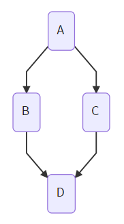

# workfl

***Workf**low Markup **L**anguage*

## Introduction

workfl is a lightweight markup language for simple workflow diagrams. It's designed to be quick to write and easy to read.

Example:

```workfl
A
B
D

A
C
D
```



You can try it out for yourself at [workfl.ws](https://workfl.ws).

The workfl python package can convert workfl markup into dictionaries of nodes and connections. There is also a method to export the workflow into [mermaid](https://mermaidjs.github.io/) syntax.

## Installation

`pip install workfl`

## Usage
```python
import workfl

markup = "A\nB"
flow = workfl.ws(markup)

print(flow.nodes)  # A dictionary of nodes
print(flow.connections)  # A dictionary of connections

mermaid = flow.to_mermaid()
print(mermaid)
```

## To Do

* Link to full syntax description once complete.
* Test scripts.
* Some characters cause problems with the mermaid export, this needs investigation.
